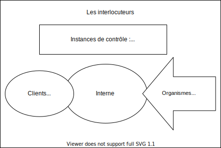

# Communication : Communication d'entreprise

- Quand la communication externe pose problème
- Communication interne externe : les croisements

## Quand la communication externe pose problème
### Communication de crise

- Reconnaissance des responsabilités
- Négotiation des faits
- Déplacement du débat
- Gestion en amont
- Gestion en aval

## Communication interne externe : les croisements
### Les interlocuteurs

## Déroulé d'une réunion

### AVANT : La preparation coté animateur

- les conditions materiels
- le choix des participants
- preparation du sujet
- Envoi de documents en pièces jointes

### Pendant

1. Accueil Convivialité
2. Explicationdu thème par l'animateur
3. Tour de table
4. Désignation secretaire de séance & afficher l'ordre du jour
5. Synthèses intermediaires
6. Synthèses finales accepté par l'ensemble du groupe
7. Organisation du suivi