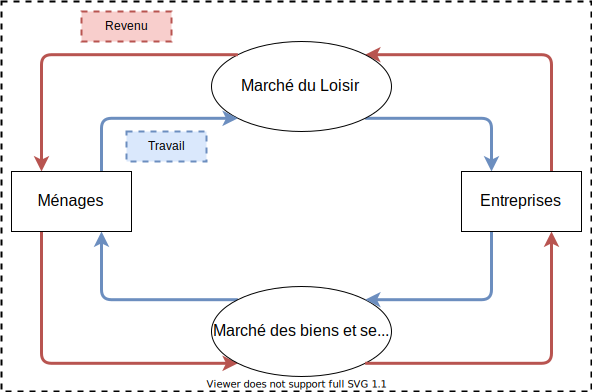

# L'économie

## Les composants
- Acteurs
  - menaces
  - Entreprises
  - Etats
- Opérations
  - Production
  - consommation
  - investissement
- Marchés
  - marché du travail
  - marché bien/services

## Le fonctionnement

Ecole liberal : "L'offre crée sa demande"

