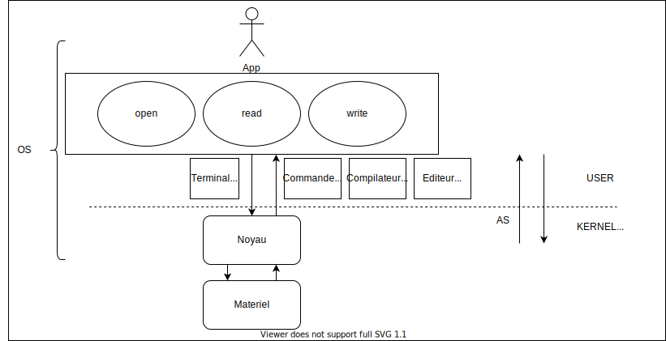
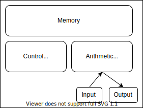

# Qu'est-ce qu'un syteme d'exploitation ?

`Interface entre l'utilisateur et le materiel`
- Demarage : (I) -> BIOS UEFI -> NOYAU -> SERVICES -> PROMPT
- Intermediaire logiciel applicatio / materiel
- optimisation
- Normalisation

### Deux visions possible 
- ressources physiques (CPU, Memoire, peripheriques)
- ressources logiciel (Processus, Fichiers)

### Les roles de L'OS

- **Allouer** les ressources
- **Controller** leur bonne utilisation
- **Problemes** : efficacité, fiabilité,sécurité,équité, etc ...

## Historique
- **1936-55** : Premiers Ordinateurs
- **1955-65** : Traitement pas lots
- **1965** : Tamponnement des *Entrée/Sortie*
- **1965-70** : Multiprogrammation
- **1970** : temps partagé

### John Von Neumann 1903-1957 

Description des 1er ordi par JVN : 
- Possibilité de **mémorisation**
- **Execution** séquentiel et possibilité de **branchement conditionnel**

Il doit donc disposer des fonctions suivantes :
1. Moyen d'**entrée**
2. Moyen de **mémorisation**
3. Moyen de **calcule**
4. Moyen de **sortie**
5. Moyen de **décision**
6. Gestion des **données** et des instructions

- Idée [1-5] introduit par **Babbage**
- Idée [6] introduit par **John Von Neumann**

### Archi de JVN

### 1er generation

- 1947 : invention du transistor
- 1950 : 1er ordinateur digne de senom , UNIVAC 1
  - Unique
  - Sans interface
  - Sans mémoire
  - Un seul prgm a la fois

